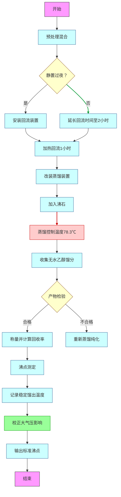

### **一、无水乙醇制备步骤**

1. **预处理与混合**
   * **步骤** ：在100mL圆底烧瓶中加入40mL 95%乙醇和10g生石灰（CaO），密封静置过夜以充分反应。
   * **仪器** ：100mL圆底烧瓶、托盘天平、量筒。
   * **试剂** ：95%乙醇、生石灰（氧化钙）  。
2. **回流加热除水**
   * **步骤** ：向烧瓶中加入沸石，安装球形冷凝管和氯化钙干燥管，加热回流1小时（控制温度约100℃）。
   * **仪器** ：电热套、球形冷凝管、干燥管、铁架台、沸石  。
   * **注意事项** ：所有仪器需预先干燥，干燥管防止水汽倒流  。
3. **蒸馏收集无水乙醇**
   * **步骤** ：回流后改为蒸馏装置（直形冷凝管、温度计、干燥管），蒸去前馏分，收集78.3℃稳定馏分。
   * **仪器** ：蒸馏头、温度计（150℃）、直形冷凝管、尾接管、锥形瓶  。
   * **试剂** ：沸石、无水氯化钙（干燥管用）  。
4. **产物检验与保存**
   * **步骤** ：用无水硫酸铜检验含水量（若变蓝则含水），称量产物并计算回收率。
   * **仪器** ：量筒、试剂瓶、托盘天平  。

### **二、沸点测定步骤**

1. **蒸馏法测沸点**

   * **步骤** ：安装蒸馏装置（温度计水银球对齐支管下沿），加热至稳定馏出（1-2滴/秒），记录沸程（约78.3℃）。
   * **仪器** ：蒸馏烧瓶、温度计、直形冷凝管、牛角管、锥形瓶  。
   * **注意事项** ：需校正大气压影响，公式为：T0=t−(0.030+0.00011t)ΔPT_0 = t - (0.030 + 0.00011t)\Delta P
     T0=t−(0.030+0.00011t)ΔP

   其中T0T_0T0为标准沸点，ttt为实测值，ΔP\Delta PΔP为气压差（Pa）  。

### **三、关键仪器与试剂清单**

| **类别** | **名称**                                                                         |
| -------------- | -------------------------------------------------------------------------------------- |
| **仪器** | 圆底烧瓶（50mL、100mL）、球形/直形冷凝管、干燥管、温度计、电热套、沸石、托盘天平、量筒 |
| **试剂** | 95%乙醇、生石灰（CaO）、无水氯化钙、无水硫酸铜（检验用）                               |

### **四、注意事项**

1. 所有仪器需彻底干燥，避免水分引入导致实验失败  。
2. 蒸馏时需控制加热速度，防止暴沸或温度波动影响沸点测定  。
3. 若需更高纯度乙醇（>99.5%），需用金属镁/钠进一步处理  。

