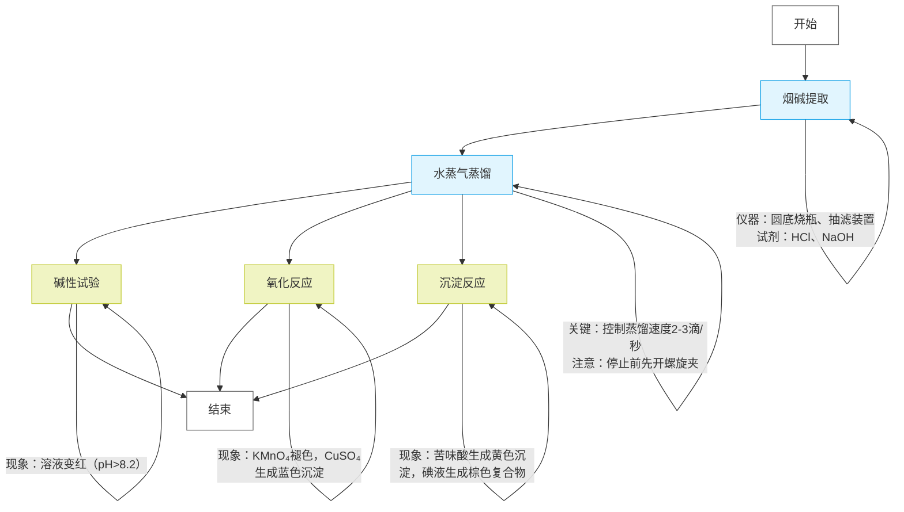

### **实验步骤与仪器试剂清单**

| **步骤**          | **操作内容**                                                                                                | **仪器**                                                                   | **试剂/材料**                 |
| ----------------------- | ----------------------------------------------------------------------------------------------------------------- | -------------------------------------------------------------------------------- | ----------------------------------- |
| **1. 烟碱提取**   | 取1g烟丝与20ml 10% HCl煮沸20分钟，补加水保持液面，抽滤后滤液用25% NaOH中和至碱性                                  | 50ml圆底烧瓶、抽滤装置（布氏漏斗、吸滤瓶）、加热套、沸石、搅拌棒                 | 烟丝、10% HCl、25% NaOH、沸石       |
| **2. 水蒸气蒸馏** | 将中和液转移至长颈蒸馏烧瓶，连接水蒸气发生器（3/4热水+沸石），蒸馏收集20ml馏出液                                  | 水蒸气发生器、长颈蒸馏烧瓶（100ml）、T形管、安全管、冷凝管、锥形瓶、螺旋夹、胶管 | 热水、沸石                          |
| **3. 碱性试验**   | 取1ml馏出液，滴加酚酞观察颜色变化（或pH试纸检测）                                                                 | 试管、滴管                                                                       | 酚酞试剂、pH广泛试纸                |
| **4. 氧化反应**   | 取5滴馏出液，依次加入0.5% KMnO₄和5% Na₂CO₃，观察颜色变化；再加5% CuSO₄观察沉淀生成                            | 试管、滴管                                                                       | 0.5% KMnO₄、5% Na₂CO₃、5% CuSO₄ |
| **5. 沉淀反应**   | 分两管操作： ① 滴加饱和苦味酸溶液至沉淀生成  ② 滴加碘液（1g KI + 0.5g I₂）观察现象 | 试管、滴管                                                                       | 饱和苦味酸溶液、碘液（KI+I₂）      |

水蒸气发生装置 和 水蒸汽蒸馏装置 

### **关键原理与注意事项**

1. **水蒸气蒸馏** ：

* **公式** ：总蒸气压 $`P_{\text{总}} = P_{\text{H} *2\text{O}} + P* {\text{烟碱}}`$  ，烟碱在100℃下蒸气压约5-10 mmHg，通过分压定律实现低温蒸馏  。
* **安全操作** ：蒸馏结束前需先打开螺旋夹，防止倒吸（参考注意事项4）。

1. **烟碱性质验证** ：

* **碱性** ：烟碱含叔胺结构，使酚酞变红（pH>8.2）。
* **氧化** ：KMnO₄在碱性条件下氧化烟碱，CuSO₄与其生成蓝色络合物沉淀。
* **沉淀反应** ：苦味酸与烟碱生成黄色盐，碘液形成棕色分子复合物  。

1. **产率优化** ：

* 烟丝中烟碱含量约2-8%，提取时需充分酸解（10% HCl煮沸20分钟）并中和至强碱性（pH≥12）以提高蒸馏效率  。

### **参考文献整合**

* 烟碱提取方法参考刘振宇（2017）的酸解-中和-蒸馏联用技术  。
* 氧化反应条件优化参考李晓芹（2015）的碱性氧化体系  。
