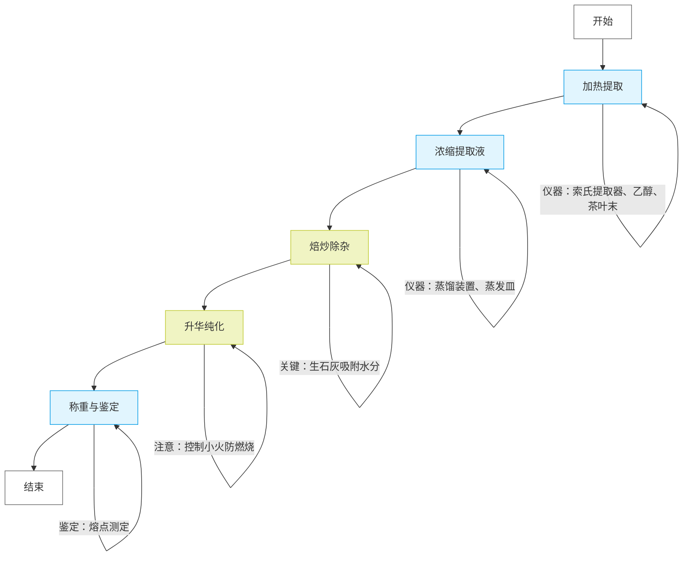

### **实验步骤与仪器试剂清单**

| **步骤**          | **操作内容**                                                             | **仪器**                                                        | **试剂/材料**   |
| ----------------------- | ------------------------------------------------------------------------------ | --------------------------------------------------------------------- | --------------------- |
| **1. 加热提取**   | 称取4g茶叶末，滤纸包裹后放入索氏提取器，烧瓶中加入50ml 95%乙醇，加热回流30分钟 | 索氏提取器、圆底烧瓶（100ml）、球形冷凝管、酒精灯、石棉网、台秤、沸石 | 95%乙醇、茶叶末、滤纸 |
| **2. 浓缩提取液** | 回收大部分乙醇，浓缩至4-5ml                                                    | 蒸馏装置（圆底烧瓶、冷凝管、尾接管）、蒸发皿、量筒（100ml）、加热套   | 回收的乙醇            |
| **3. 焙炒除杂**   | 向浓缩液中加入2-3g生石灰，蒸干后焙炒至完全干燥                                 | 蒸发皿、玻璃棒、酒精灯、石棉网、坩埚钳                                | 生石灰                |
| **4. 升华纯化**   | 覆盖刺孔滤纸，倒扣漏斗，小火加热至白色针状结晶析出，冷却后刮取产物             | 蒸发皿、刺孔滤纸、漏斗、棉花、表面皿、结晶铲、石棉网                  | 无（产物为咖啡因）    |
| **5. 称重与鉴定** | 称量产物质量，计算产率；测定熔点（纯净咖啡因234.5℃）                          | 分析天平、熔点仪、表面皿                                              | 无                    |

图 1 脂肪提取器：1- 滤纸套  2- 提取器 3- 玻璃套  4- 虹吸管 

### **说明**

1. **加热提取** ：

* 索氏提取器通过虹吸循环实现高效萃取，乙醇溶解茶叶中的咖啡因。
* **关键点** ：滤纸包裹茶叶需严密，避免堵塞虹吸管。

1. **升华纯化** ：

* 生石灰吸附残留水分和色素，升华时需刺孔滤纸引导蒸气结晶。
* **关键点** ：升华温度需严格控制在100℃以下，防止产物自燃。

1. **产率计算** ：

* 理论产率参考：茶叶中咖啡因含量约2-5%，实际产率需结合操作损耗。

### **注意事项**

* **索氏提取器使用** ：若虹吸无法停止，需降低加热温度。
* **升华操作** ：冷却至室温后再刮取产物，避免咖啡因氧化。