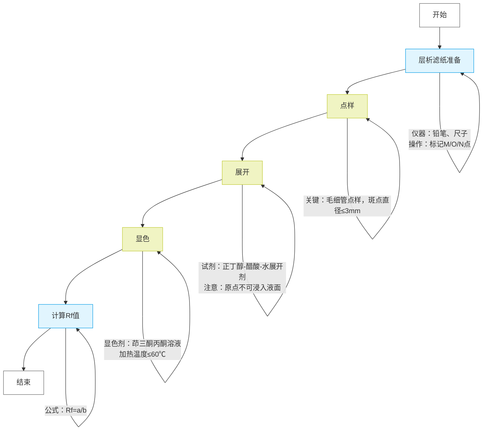

### **实验步骤与仪器试剂清单**

| **步骤**            | **操作内容**                                                                              | **仪器**                                                                  | **试剂/材料** |
| ------------------------- | ----------------------------------------------------------------------------------------------- | ------------------------------------------------------------------------------- | ------------------- |
| **1. 层析滤纸准备** | 在滤纸距一端2cm处划起点线，标记M、O、N三点，距边缘≥1cm                                         | 层析滤纸（9cm×20cm）、铅笔、尺子                                               | 无                  |
| **2. 点样**         | 用毛细管依次点样：O点（混合液）、M点（丙氨酸）、N点（亮氨酸），每点重复2次，风干后斑点直径≤3mm | 毛细管（1mm）、氨基酸混合液、0.2%丙氨酸乙醇溶液、0.2%亮氨酸乙醇溶液、电吹风     | 氨基酸溶液、混合液  |
| **3. 展开**         | 层析缸注入展开剂，悬挂滤纸使原点线浸入液面下1cm，密闭展开至溶剂前沿距顶端3-4cm                  | 标本缸（10cm×30cm）、展开剂（正丁醇:醋酸:水=4:1:5）、细绳/铁丝固定滤纸、计时器 | 展开剂              |
| **4. 显色**         | 取出滤纸标记溶剂前沿，喷洒1%茚三酮丙酮溶液，电吹风加热至紫色斑点显现                            | 喷雾器、电吹风、铅笔                                                            | 1%茚三酮丙酮溶液    |
| **5. 计算Rf值**     | 测量斑点中心与原点距离（a）、溶剂前沿与原点距离（b），计算$`R_f = \frac{a}{b}`$                  | 尺子                                                                            | 无                  |

### **关键原理与注意事项**

1. **层析原理** ：

* **分配系数差异** ：氨基酸在固定相（滤纸吸附水）与流动相（有机展开剂）中的溶解度不同导致迁移速率差异。
* **Rf值计算** ：极性小的氨基酸（如亮氨酸）在展开剂中溶解度更高，Rf值较大；极性大的丙氨酸Rf值较小。

1. **操作优化** ：

* **点样技巧** ：毛细管需垂直轻触滤纸，避免扩散过大（直径≤3mm）。若样品浓度低，可重复点样3-4次。
* **展开控制** ：层析缸需密闭以饱和蒸气，展开时间约20-40分钟，溶剂前沿上升速度约1cm/10分钟。

1. **显色条件** ：

* 茚三酮与α-氨基酸反应生成紫色化合物（脯氨酸显黄色），加热温度过高会导致斑点模糊或碳化。

### **仪器试剂替代方案**

* **层析缸替代** ：可用大试管或烧杯+保鲜膜密封代替。
* **喷雾器替代** ：滴管均匀滴加显色剂（需覆盖整个滤纸）。
* **展开剂调整** ：若分离效果差，可调整正丁醇:醋酸:水比例为3:1:1或5:1:4。

### **思考题参考**

1. **Rf值意义** ：反映化合物在固定相与流动相中的分配比例，受温度、滤纸类型、溶剂系统影响。
2. **极性判断** ：亮氨酸Rf值＞丙氨酸，说明亮氨酸极性更小（疏水性更强），丙氨酸极性更大（亲水性更强）。

更多细节可参考《分析化学实验技术手册》或生物化学层析技术指南。
